# 📱 Remote ADB Tool

<div align="center">


**Seamlessly debug Android devices remotely. Connect your USB farm to your workstation, wirelessly.**

[Getting Started](#installation) • [Usage](#usage) • [Architecture](#architecture) • [Contributing](#contributing)

</div>

---

## 🚀 Overview

**Remote ADB Tool** solves the headache of physical device management. Do you have a drawer full of test devices at home but work from a cafe? Or perhaps a centralized "device lab" in your office? 

This tool allows you to **serve** devices from one machine (the Gateway) and **connect** to them from another (the Client) as if they were plugged directly into your USB port. It automates the complexity of SSH tunneling, ADB port forwarding, and connection management.

## ✨ Features

- 🔌 **Plug & Play Serving:** Automatically detects USB devices and sets up ADB over TCP/IP.
- 🛡️ **Secure Tunneling:** Uses SSH for encrypted, secure connections between machines.
- 🎯 **Interactive CLI:** Select exactly which devices you want to connect to with a beautiful terminal UI.
- 🔄 **Auto-Reconnect:** Robust handling of device connections.
- 🍏 **Cross-Platform:** Works on macOS, Linux, and Windows (via WSL).

## 🎨 Architecture

Here is how the magic happens. One computer acts as the **Gateway** (hosting physical devices), and your **Client** machine connects via a secure tunnel.

```mermaid
graph LR
    subgraph Gateway["🖥️ Gateway Machine (Home/Lab)"]
        USB1[("📱 Pixel 7")]
        USB2[("📱 Galaxy S23")]
        Daemon["⚙️ ADB Remote Daemon"]
        USB1 --- Daemon
        USB2 --- Daemon
    end

    subgraph Network["☁️ Network / Internet"]
        SSH["🔒 SSH Tunnel"]
    end

    subgraph Client["💻 Client Machine (Laptop/Cafe)"]
        CLI["🛠️ ADB Remote CLI"]
        AS["🤖 Android Studio"]
        CLI --- AS
    end

    Daemon <==> SSH <==> CLI
    style Gateway fill:#e1f5fe,stroke:#01579b
    style Client fill:#fff3e0,stroke:#e65100
    style Network fill:#f3e5f5,stroke:#4a148c
```



## 📦 Installation

```bash
# Clone the repository
git clone https://github.com/arjun1194/remote-adb-tool.git

# Go into the directory
cd remote-adb-tool

# Install dependencies
npm install

# Build the project
npm run build

# Link globally (optional, for easy access)
npm link
```

## 🕹️ Usage

### 1. The Gateway (Device Host)
On the computer physically connected to the Android devices:

```bash
$ adb-remote serve
```
*This will detect devices, enable TCP/IP, and listen for connections.*

### 2. The Client (Your Workstation)
On the computer where you want to run Android Studio:

```bash
# Syntax: adb-remote connect <ssh-user>@<gateway-ip>
$ adb-remote connect arjun@192.168.1.5
```
*Follow the interactive prompt to select devices. Once connected, they appear in `adb devices` automatically!*

## 🤝 Contributing

Contributions, issues, and feature requests are welcome! Feel free to check the [issues page](https://github.com/arjun1194/remote-adb-tool/issues).

## 📝 License

This project is [ISC](LICENSE) licensed.

---
<div align="center">
Made with ❤️ by <a href="https://github.com/arjun1194">Arjun</a>
</div>